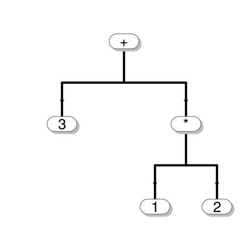

Dissecting R Calls, Expressions and Functions
========================================================
author: S Legrand
date: 2014.07.30


<div style='text-align: bottom;'>
    
</div>

The Parse and Evaluate Idiom
===
To evaluate a character string as R-code, the usual thing to do
is to use ***eval(parse(text=myString))***. For example

```r
eval(parse(text="1+2"))
```

```
[1] 3
```

But this begs the question, what does ***parse*** return?

Parse Returns Expressions
===
A quick check shows that parse returns an object called an **expression**

```r
ex1<-parse(text="1+2")
mode(ex1)
```

```
[1] "expression"
```

Invoking help on **expression** reveals other ways to create an expression

More Ways to Create Expressions
===


```r
#directly
 expression(1+2)
```

```
expression(1 + 2)
```

***

```r
#using as.expression 
cl<-quote(1+2)
as.expression(cl)
```

```
expression(1 + 2)
```


Whats Inside an Expression?
===
What we want know is whats inside, that is, what are expressions made of?

So we start by dissection of an expression 

Dissecting an Expression
===
We  dissect  an expression using the [[]] operator

```r
ex<-expression(1+2)
length(ex)
```

```
[1] 1
```

```r
ex[[1]]
```

```
1 + 2
```

```r
mode(ex[[1]])
```

```
[1] "call"
```

Think: Expression = Special List
===

```r
cl<-call("+",1,2)
ex.cl<-list(cl)
mode(ex.cl)<-"expression"
identical(ex.cl, expression(1+2))
```

```
[1] TRUE
```
So an **expression** is a specialized list with mode ***expression*** 

Technically an **expression** is a primitive, and we may be doing some coercing, but
it's easiest to think of them as some kind of specialized list.

Building Blocks of Expressions 
===
The building blocks of an **expression** can be any of the following:
- calls 
- symbols 
- constants

Some Simple Expressions
===

```r
 ex1<-expression(1+2)
 mode(ex1[[1]])
```

```
[1] "call"
```

```r
 ex2<-expression(x)
 mode(ex2[[1]])
```

```
[1] "name"
```

```r
 ex3<-expression(3)
 mode(ex3[[1]])
```

```
[1] "numeric"
```

Some Checks for the Mode
===

```r
  c(is.expression(expression(1+2)),
  is.call(expression(1+2)[[1]]),
  is.symbol(expression(x)[[1]]),
  is.numeric(expression(3)[[1]]))
```

```
[1] TRUE TRUE TRUE TRUE
```

Expressions Can Contain Multiple Calls
===
**Expressions** can contain multiple components.
For example the following **expression** contain 2 **calls**

```r
ex1<-expression(x<-1,x+2)
ex1
```

```
expression(x <- 1, x + 2)
```

```r
ex2<-parse(text="x<-1;x+2")
ex2
```

```
expression(x <- 1, x + 2)
```

Calls
===
- **Calls** often occur as elements fo  **expressions** 
- **Calls** represent something to be evaluated, for example: 1+2
- **Calls** are _where_ _things_ _get_ _done_

6 Ways to Create  Calls
===

```r
parse(
  text="1+2")[[1]]
```

```
1 + 2
```

```r
call("+",1,2)
```

```
1 + 2
```

```r
quote(1+2)
```

```
1 + 2
```
***

```r
as.call( list(as.name("+"), 1,2))
```

```
1 + 2
```

```r
substitute(1+2)
```

```
1 + 2
```

```r
fn<-function(){1+2}
body(fn)[[2]]
```

```
1 + 2
```

Calls are Specialized Lists
===

```r
list(as.name("+"),1,2)->cl
mode(cl)<-"call"
identical(cl, call("+",1,2))
```

```
[1] TRUE
```
**Calls** are specialized lists with mode ***call***

Technically a **call** is  a primitive, and we are  doing some coercing. But as with **expressions**, the most convenient way to think of a **call** is as some kind of _specialized_ list.

Evaluating Calls
===
**Calls** can also be evaluated using **eval**

```r
cl1<-parse(text="1+2")[[1]]
eval(cl1)
```

```
[1] 3
```

Dissecting a Call
===
We can dissect a call and examine it's components  using the [[]] operator

```r
cl1[[1]]
```

```
`+`
```

```r
cl1[[2]]
```

```
[1] 1
```

```r
cl1[[3]]
```

```
[1] 2
```

Calls can even be Modified!
===

```r
cl1<-quote(1+2)
cl1
```

```
1 + 2
```

```r
fn<-function(x,y){
  1+x^y
}
```
***

```r
cl1[[1]]<-as.name("fn")
cl1 # Replaced + with fn
```

```
fn(1, 2)
```

```r
eval(cl1) 
```

```
[1] 2
```

A slightly more complex example
=====


```r
cl<-quote(1*2+3)
cl
```

```
1 * 2 + 3
```

Note: we now have both * and + inside our **call**

Drilling down Reveals a Tree
===

```r
cl[[1]]
```

```
`+`
```

```r
cl[[2]]
```

```
1 * 2
```
***

```r
cl[[2]][[1]]
```

```
`*`
```

```r
cl[[2]][[2]]
```

```
[1] 1
```

```r
cl[[2]][[3]]
```

```
[1] 2
```

A Call is a Tree
===
- A **Call** is a tree consisting of **terminal** and **non-terminal** nodes.
- A **non-terminal node** is list consisting of a name (usually a function)
followed by it's children.
+ Ex: call('+',1,2)

- A **terminal node** is a value or the name of a function with no args.

- We call this  tree an **abstract syntax tree (AST)**


The Tree Structure of the Call cl
===

Accessor | Position | Role | Description
---------|---------|---------|---------
cl | root | Non-terminal | (+, 1 * 2, 3)
cl[[1]] |root label|  Label | +
cl[[2]] | 1st child of root| Non-terminal | (*, 1, 2)
cl[[3]] | 2nd child of root| Terminal | 3
cl[[2]][[1]] |  root 1st child label |  Label  | *
cl[[2]][[2]] | 1st child of cl[[1]][[2]]| Terminal  | 1
cl[[3]][[2]] | 2nd child of cl[[1]][[2]]| Terminal | 2 

Displaying the tree
===
The package ***pryr*** makes it a little easier to see this structure

```r
library(pryr)
call_tree(cl)
```

```
\- ()
  \- `+
  \- ()
    \- `*
    \-  1
    \-  2
  \-  3 
```

Graphicaly
===
 
***
Here we used the package ***diagram*** to do our rendering :)

Manipulating a Call Tree
===
We can even manipulate to rearrange precedence!

```r
cl.orig<-parse(text="1*2+3")[[1]]
cl.orig
```

```
1 * 2 + 3
```

```r
tmp<-cl.orig
cl.mod<-cl.orig[[2]]
cl.mod[[3]]->tmp[[2]]
cl.mod[[3]]<-tmp
cl.mod
```

```
1 * (2 + 3)
```

The Original vs Modified Tree
===

```r
call_tree(cl.orig) 
```

```
\- ()
  \- `+
  \- ()
    \- `*
    \-  1
    \-  2
  \-  3 
```
***

```r
call_tree(cl.mod)
```

```
\- ()
  \- `*
  \-  1
  \- ()
    \- `+
    \-  2
    \-  3 
```

The Body of a Function is a Call
===

```r
fn<-function(){1+2}
cl<-body(fn)
mode(cl)
```

```
[1] "call"
```
***

```r
call_tree(cl)
```

```
\- ()
  \- `{
  \- ()
    \- `+
    \-  1
    \-  2 
```

Calls may contain Calls
===

```r
cl<-body(
  function(){
  1+2
  }
)
mode(cl)
```

```
[1] "call"
```

```r
length(cl)
```

```
[1] 2
```
***

```r
mode(cl[[2]])
```

```
[1] "call"
```

```r
cl[[2]]
```

```
1 + 2
```
Here, the call cl, contains
 the call cl[[2]]

The body of a 2 line function
===

```r
fn<-function(x){
  y<-x+1
  2*y
}
cl<-body(fn)
length(cl)
```

```
[1] 3
```
***

```r
call_tree(cl)
```

```
\- ()
  \- `{
  \- ()
    \- `<-
    \- `y
    \- ()
      \- `+
      \- `x
      \-  1
  \- ()
    \- `*
    \-  2
    \- `y 
```

Piece-wise Function Construction
===
We can construct a new function in steps:

1. Start with an empty skeleton function 
2. Insert a body
3. Specify the arguments
4. Specify an environment


A Skeleton Function 
===

```r
fn<-function(){}
fn
```

```
function(){}
```


Inserting a Body
===


```r
body(fn)<-call("{",quote(y<-x+1),quote(2*y) )
fn
```

```
function () 
{
    y <- x + 1
    2 * y
}
```
The function body now contains 2 lines.

Specifying  Arguments
===

```r
formals(fn)<-alist(x=)
fn
```

```
function (x) 
{
    y <- x + 1
    2 * y
}
```

The function now has an argument ***x***. If we wanted a default value of ***x=2***,
we would have specified ***alist(x=2)***

Specifying an Environment
===

```r
environment(fn) <- .GlobalEnv
environment(fn)
```

```
<environment: R_GlobalEnv>
```

Here we set the environment of the function to be the Global environment

Variable Functions On the Fly
===
When we don't know what or how many statements the function may contain, then 
to create the body we might generate a list of either ***calls** or ***character strings***. 

To illustrate this, we take an example motivated by continued fractions.
Given n, we want to generate a function that contains n copies of the 
line 
```
x<-1/(1+x)
```

We illustrate 2 approaches:

Generating a List of Calls
===
First we generate a list of calls


```r
n<-3
fn1<-function(x){} #A skeleton
cl<-quote(x<-1/(1+x))
cl.list<-c(rep(list(cl),n),quote(x))
#display the list as text using deparse
deparse(cl.list) #for display only!!
```

```
[1] "list(x <- 1/(1 + x), x <- 1/(1 + x), x <- 1/(1 + x), x)"
```

Body Creation from a List of Calls
===


```r
body(fn1)<-as.call(c(as.name("{"),cl.list))
fn1
```

```
function (x) 
{
    x <- 1/(1 + x)
    x <- 1/(1 + x)
    x <- 1/(1 + x)
    x
}
```

Note  use **as.call** with lists of calls

Generating a List of Strings
===

```r
n<-3
s<-"x<-1/(1+x)"
s.list<-c(rep(list(cl),n),"x")
s.list
```

```
[[1]]
x <- 1/(1 + x)

[[2]]
x <- 1/(1 + x)

[[3]]
x <- 1/(1 + x)

[[4]]
[1] "x"
```

Body from a List of Strings
===

```r
fn2<-function(x){} #A skeleton
ex<-parse(text=paste(s.list,collapse=";"))
body(fn2)<-as.call(c(as.name("{"),ex))
fn2
```

```
function (x) 
{
    x <- 1/(1 + x)
    x <- 1/(1 + x)
    x <- 1/(1 + x)
    x
}
```
Note, here we use **parse**, which produces an **expression**, which
becomes the argument of **as.call**

Comparing and Running fn1, fn2
===

```r
identical(fn1,fn2)
```

```
[1] TRUE
```

```r
fn1(2)
```

```
[1] 0.5714
```

```r
fn2(2)
```

```
[1] 0.5714
```

Turning a Call into a String 
===
Use **deparse** to turn a call into a character string.

```r
cl1<-quote(1+2)
cl2<-parse(text="1+2")[[1]]
identical(deparse(cl1),deparse(cl2))
```

```
[1] TRUE
```

```r
mode(deparse(cl1))
```

```
[1] "character"
```

```r
deparse(cl1)
```

```
[1] "1 + 2"
```

The Substitute-Deparse Trick
===

```r
a<-3
times<-function(x,y){
  cl<-substitute(x*y)
  paste(deparse(cl),"is",eval(cl))
}
times(2,a)
```

```
[1] "2 * a is 6"
```
Upon executation, **substitute**, substitutes ***2*** and ***a*** for ***x*** and ***y*** respectively to form a **call**, (which is the unevaluated AST ***quote(2 * a)***). Then by turning that **call** back into a string via **deparse** we obtain the names of function inputs.

Summary (1/3)
===
- Use **parse** to turn a character string into an **expression**
- Use **deparse** to turn a **call** into a character string
- **Expressions** are specialied lists of mode ***"expression"***
+ An elements of an **Expression** may be **call**, **symbol**, ro **constant** 

Summary --Continued-- (2/3)
===
- **Calls** are specialized lists of mode ***"call"***
+ The first element of a **call**  is  name (usually naming a function)
+ Any subsequent elements occuring  list are children 
+ A child can be either a **call** or a **constant** (value)
- **Calls** are  **Abstract Syntax Trees** coded as  ***liss*** structures
+ A node on the **AST** is either a **call** or a value
- The structure inside a **call** can be manipulated.

Summary --Continued-- (3/3)
===
- Use **as.call** to turn a list of calls into a call.
- A function body is a **call** with the first element being the  symbol { 
- **calls**  are returned by **substitute**, **quote**, etc.
- Use **eval** to evaluate both **expressions** and **calls**
- Together **deparse** and **substitute** can be used to obtain the runtime input symbols of within a function.

